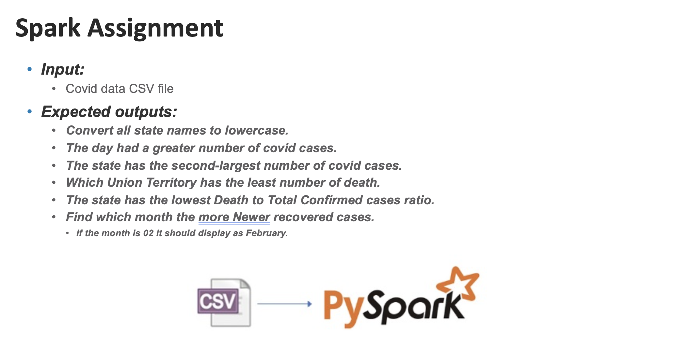

# BigData - Hadoop and PySpark

## COVID-19 Data Analysis using PySpark

This project performs analysis on COVID-19 data using Apache Spark (PySpark). The analysis includes the following tasks:

1. **Install Dependencies**
   - `pyspark` is required for running this notebook.
   - Install PySpark using: `pip install pyspark`

2. **Setup Spark Session**
   - A Spark session is initialized with custom configurations to handle large datasets efficiently.

3. **Data Loading**
   - The dataset is loaded from a CSV file (`covid-data.csv`) using Spark's DataFrame API with various options to handle formatting issues such as leading/trailing whitespaces and escaped characters.

4. **Analysis Tasks**

5. **Results**
   - The results for the tasks are displayed using Spark's `show()` function, printing the state with the lowest ratio and the month with the highest recovered cases.

6. **Execution**
   - Ensure that the dataset is placed in the specified path (`covid-data.csv`).
   - Run the notebook cells sequentially to perform the analysis.